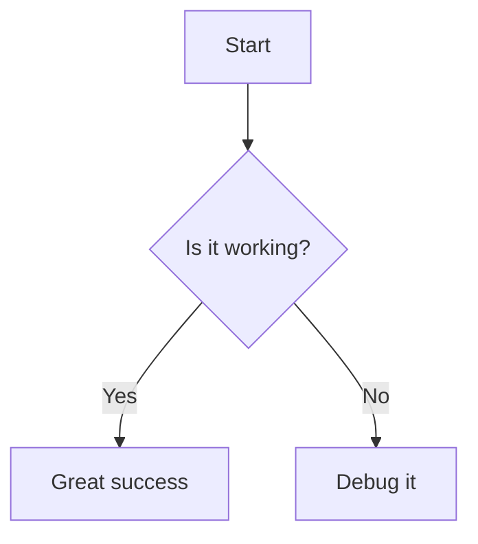

<h1 align="center">mq-view</h1>

[](https://github.com/harehare/mq-view/actions/workflows/ci.yml)

A library and CLI tool for rendering Markdown documents with syntax highlighting and rich text formatting.
Built with [mq](https://github.com/harehare/mq) - jq-like command-line tool for markdown processing.


## Features

- 🎨 **Syntax Highlighting**: Tree-sitter powered syntax highlighting for 29+ programming and config languages
- 📝 **Rich Markdown Rendering**: Support for headers, lists, code blocks, links, images, tables, and more
- 🧜 **Mermaid Diagrams**: Best-effort ASCII-art rendering of simple `graph`/`flowchart` blocks
- 🔔 **GitHub-style Callouts**: NOTE, TIP, IMPORTANT, WARNING, CAUTION, rendered as wrapped, bordered boxes
- 🔗 **Clickable Links**: Terminal hyperlinks using OSC 8
- 📖 **Pager Mode**: Interactive full-screen viewer with scrolling, a heading outline, search, and auto-reload on file changes

## Installation

### Quick Install

```bash
curl -sSL https://raw.githubusercontent.com/harehare/mq-view/refs/heads/main/bin/install.sh | bash
```

The installer will:
- Download the latest mq-view binary for your platform
- Install it to `~/.local/bin/`
- Update your shell profile to add mq-view to your PATH

### Cargo

From crates.io (stable):

```sh
cargo install mq-view
```

From git (latest):

```sh
cargo install --git https://github.com/harehare/mq-view.git
```

## Supported Languages

Enabled by default:

- Rust, JavaScript, TypeScript (+ TSX), Python
- HTML, CSS, JSON, YAML, TOML
- Bash/Shell, Ruby, SQL
- Elixir, mq

Available with the `all-languages` feature:

- Go, Java, Kotlin, Scala
- C, C++, Swift
- PHP, Lua, Clojure, Haskell, OCaml, Elm
- Dockerfile, Makefile

See `Cargo.toml` for the full list of `lang-*` feature flags if you only need
one or two extra languages instead of all of them.

## Usage

### As a CLI Tool

View a markdown file:

```bash
mq-view README.md
```

Pipe markdown content:

```bash
echo "# Hello\n\n\`\`\`rust\nfn main() {}\n\`\`\`" | mq-view
```

### Pager Mode

Open an interactive, full-screen viewer with `--pager` (`-p`):

```bash
mq-view --pager README.md
```

It also works with piped content, but without a file to watch there's
nothing to auto-reload:

```bash
cat report.md | mq-view --pager
```

| Key | Action |
| --- | --- |
| `j` / `k`, `↓` / `↑` | Scroll down / up |
| `Space` / `PageDown` / `f`, `PageUp` / `b` | Scroll a page down / up |
| `d` / `u` (with or without `Ctrl`) | Scroll half a page down / up |
| `g` / `Home`, `G` / `End` | Jump to top / bottom |
| `Tab` | Toggle the heading outline; `j`/`k` to move, `Enter` to jump |
| `/` | Search; `Enter` to confirm, `Esc` to cancel |
| `n` / `N` | Jump to the next / previous search match |
| `q` / `Esc` | Quit |

When viewing a file (not piped input), the pager watches it and
automatically re-renders whenever it changes on disk.

### Mermaid Diagrams

Fenced code blocks tagged ` ```mermaid ` are rendered as ASCII art instead of
plain text when the diagram is a simple `graph`/`flowchart`:



This only understands a small subset of mermaid flowchart syntax (nodes,
shapes, and edges with optional labels). Other diagram types (sequence,
class, gantt, ...) and advanced flowchart syntax fall back to a regular,
syntax-highlighted code block.

## License

MIT
